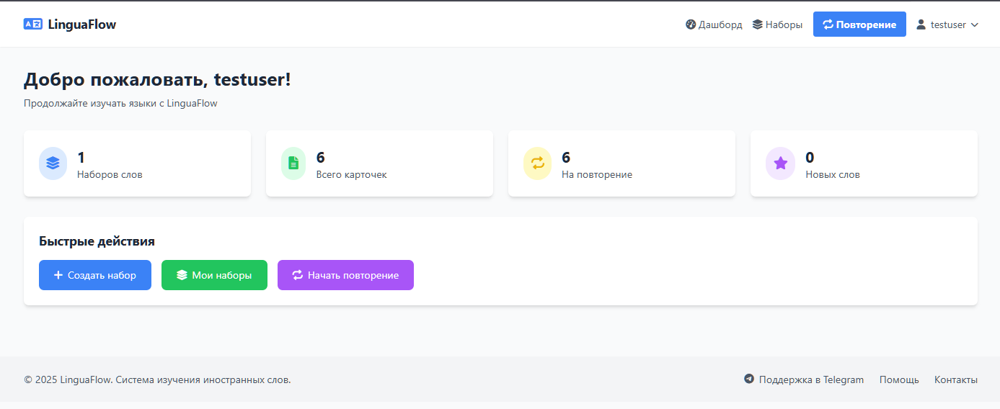
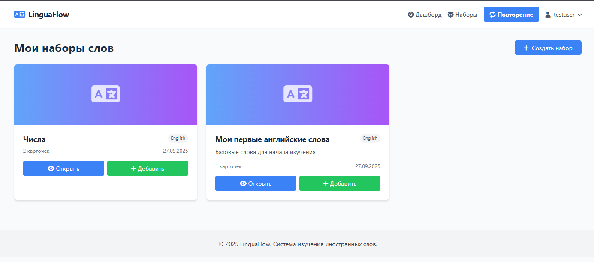
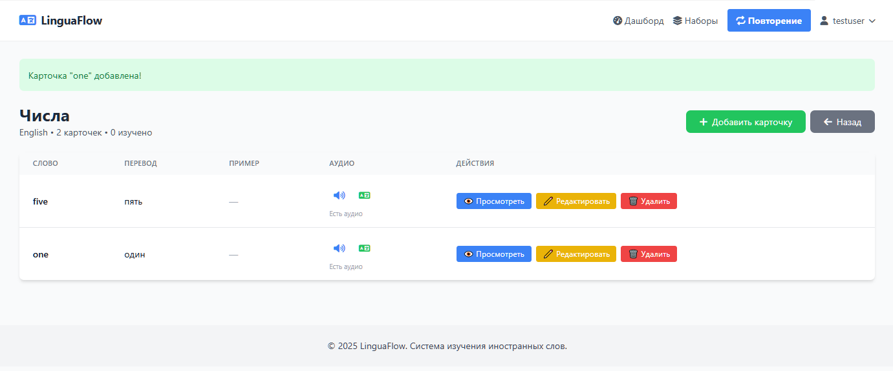
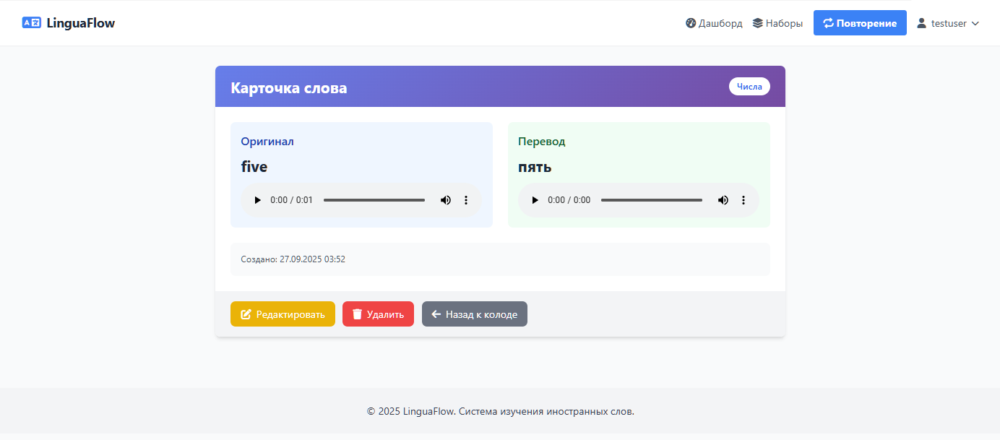

# LinguaFlow


<h1 align="center">LinguaFlow - Эффективное изучение иностранных слов</h1>

<p align="center">
  <strong>Минималистичное  веб-приложение для запоминания слов с помощью интервальных повторений (SRS).</strong><br>
  <em>Создано с использованием Django, Tailwind CSS и Telegram Bot API.</em>
</p>

<p align="center">
  <a href="#описание">Описание</a> •
  <a href="#функции">Функции</a> •
  <a href="#скриншоты">Скриншоты</a> •
  <a href="#демонстрация">Демонстрация</a> •
  <a href="#установка">Установка</a> •
  <a href="#использование">Использование</a> •
  <a href="#структура-базы-данных">Структура БД</a> •
  <a href="#технологии">Технологии</a> •
  <a href="#авторы">Авторы</a> •
  <a href="#лицензия">Лицензия</a>
</p>

---

## Описание

**LinguaFlow** — это веб-приложение, разработанное для помощи в изучении иностранных языков, особенно для эффективного и надежного запоминания словарного запаса. Оно использует **метод интервальных повторений (SRS)**, чтобы оптимизировать процесс обучения, показывая слова именно в тот момент, когда вы с наибольшей вероятностью их забудете. Приложение сочетает в себе удобный веб-интерфейс для управления словарем и гибкий Telegram-бот для ежедневных напоминаний и мобильного повторения.

---

## Функции

*   **Интервальные повторения (SRS):** Умный алгоритм, который определяет оптимальное время для повторения каждого слова.
*   **Управление словарем:** Создание наборов слов, добавление карточек с переводом, примерами и автоматической озвучкой.
*   **Веб-интерфейс:** Современный, адаптивный и минималистичный дизайн для комфортного изучения на компьютере или планшете.
*   **Дашборд:** Отслеживание прогресса: количество слов на сегодня, текущая серия дней, график.
*   **Озвучка (TTS):** Автоматическая генерация аудио для слов и примеров с использованием Google Text-to-Speech.
*   **Интеграция с Telegram:** Привязка аккаунта к боту для получения ежедневных напоминаний и возможности проходить короткие сессии повторения в чате.
*   **Адаптивный дизайн:** Корректное отображение на устройствах с различными размерами экранов.

---

## Скриншоты

<div align="center">
   <!-- Замените на путь к скриншоту -->
   <!-- Замените на путь к скриншоту -->
   <!-- Замените на путь к скриншоту -->
   <!-- Замените на путь к скриншоту --> 
</div>

---

## Демонстрация

<div align="center">
  <video width="80%" controls>
    <source src="screenshots/0928.mp4" type="video/mp4"> <!-- Замените на путь к видео -->
    Your browser does not support the video tag.
  </video>
  <p><em>Краткая демонстрация основного функционала и озвучки слов.</em></p>
</div>

---

## Установка

1.  **Клонируйте репозиторий:**
    ```bash
    git clone https://github.com/KaMoHub/linguaflow.git
    cd linguaflow
    ```

2.  **Создайте виртуальное окружение (рекомендуется):**
    ```bash
    python -m venv venv
    source venv/bin/activate  # On Windows use `venv\Scripts\activate`
    ```

3.  **Установите зависимости:**
    ```bash
    pip install -r requirements.txt
    ```

4.  **Настройте переменные окружения (`.env`):**
    Создайте файл `.env` в корне проекта и добавьте необходимые переменные, такие как:
    *   `TELEGRAM_BOT_TOKEN`: Токен вашего Telegram-бота.
    *   `GOOGLE_APPLICATION_CREDENTIALS`: Путь к файлу учетных данных Google Cloud (если используется gTTS с ключом API).
    *   `DJANGO_SECRET_KEY`: Секретный ключ Django.
    *   `DATABASE_URL`: (опционально) URL базы данных, если используется не SQLite.

5.  **Выполните миграции:**
    ```bash
    python manage.py migrate
    ```

6.  **Создайте суперпользователя (опционально):**
    ```bash
    python manage.py createsuperuser
    ```

7.  **Запустите Django-сервер:**
    ```bash
    python manage.py runserver
    ```

---

## Использование

1.  Перейдите на `http://127.0.0.1:8000/` в вашем браузере.
2.  Зарегистрируйтесь или войдите в систему.
3.  Начните добавлять слова в свои наборы.
4.  Используйте веб-интерфейс для повторения слов в соответствии с SRS.
5.  Привяжите ваш Telegram-аккаунт в настройках профиля для получения напоминаний.

---

## Структура базы данных

<div align="center">
   <!-- Замените на путь к PNG диаграмме -->
  <p><em>Схема связей между основными моделями.</em></p>
</div>

---

## Технологии

*   **Backend:** [Python](https://www.python.org/) 3.11+, [Django](https://www.djangoproject.com/) 5.x
*   **База данных:** [SQLite](https://www.sqlite.org/index.html) (для разработки)
*   **Frontend:** [HTML5](https://developer.mozilla.org/en-US/docs/Web/Guide/HTML/HTML5), [CSS3](https://developer.mozilla.org/en-US/docs/Web/CSS), [Tailwind CSS](https://tailwindcss.com/)
*   **API:** [Google Text-to-Speech (gTTS)](https://cloud.google.com/text-to-speech/docs), [Telegram Bot API](https://core.telegram.org/bots/api)
*   **Библиотеки:** `python-telegram-bot`, `gTTS`, `django-crispy-forms`, `celery` (для фоновых задач), `redis`

---

## Примечание

*   Настроечный файл settings.py содержит дополнительные настройки, такие как `TELEGRAM_BOT_TOKEN` и `GOOGLE_APPLICATION_CREDENTIALS`.  Но вы его создаете сами, на основе стандартных настроект Django. 

---

## Авторы

*   **[Моякулова Екатерина / KaMoHub GitHub]** - *Основной разработчик* - [https://github.com/KaMoHub](https://github.com/KaMoHub)

---

## Лицензия

Этот проект лицензирован по лицензии MIT - смотрите файл [LICENSE](LICENSE) для подробностей.

---
